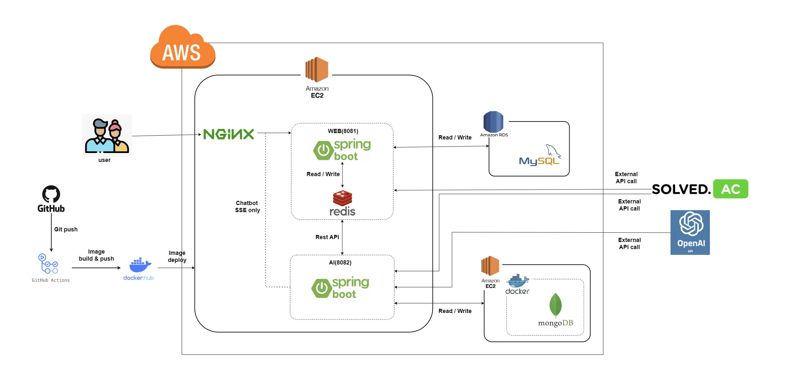

# Algoy-AI 
Web과 외부 AI API 사이의 추천 adapter 서비스

## 프로젝트 소개

Algoy는 알고리즘 학습과 문제 추천을 지원하는 웹 서비스입니다. 사용자는 풀이 이력을 바탕으로 AI 추천을 받고, 학습 기록을 관리할 수 있습니다.

본 프로젝트는 1차 개발 이후 2차 개발을 거쳐 개선했습니다

1차 개발: solved.ac 풀이 이력을 기반으로 Allen AI API를 연동해 문자열 형태의 추천 결과를 반환하는 추천 기능을 구현했습니다.

2차 개발: 추천 엔진을 OpenAI API 기반으로 전환했고, 문자열 응답 중심 구조를 구조화된 JSON 응답으로 변경했으며, 추천 결과를 MongoDB에 저장하는 기능을 구현했습니다.

- 프로젝트 기간: 1차 2024.08.19 - 2024.09.12 / 2차 2026.04.03 - 2026.04.23
- 진행 형태: 6인 팀 프로젝트
- 담당 영역:
    - AI 추천 서비스 분리 아키텍처 설계
    - OpenAI 기반 문제 추천 기능 구현
    - 문자열 응답 기반 추천 API를 JSON 구조화 응답으로 고도화
    - 추천 결과 MongoDB 저장 구조 설계 및 연동
    - solved.ac 기반 추천 프롬프트 생성 로직 구현
    - CI/CD 배포 자동화
    - Nginx 설정 및 서버 환경 구축


## As-Is (1차 개발)

solved.ac(API) 사용자 풀이 이력을 조회한 뒤, 이를 Allen AI API에 전달할 프롬프트로 가공해 문제를 추천하는 구조였습니다.

- Web 애플리케이션과 AI 추천 기능을 분리 배포해 추천 기능을 별도 서비스로 운영했습니다.
- 추천 결과는 문자열(String) 형태의 응답으로 반환했습니다.
- 사용자 이력 조회, 프롬프트 생성, 외부 AI 호출이 하나의 추천 흐름 안에 묶여 있는 구조였습니다.
- 외부 AI 연동은 GET 기반 요청 방식으로 구현했습니다.


## 문제 상황

- 기존 추천 기능은 특정 외부 AI 서비스에 의존하고 있었고, 해당 서비스 종료로 인해 추천 기능을 다른 LLM API 기반으로 전환해야 했습니다.
- 기존 방식은 연동 과정에서 일부 요청이 안정적으로 처리되지 않는 문제가 있었습니다. 또한 1차 개발에서는 외부 API 호출 방식이
  여러 형태로 섞여 있어 유지보수 기준도 일관되지 않았습니다.
- 1차 개발의 문자열 응답 방식은 추천 결과의 저장과 후속 활용에 한계가 있어, 추천 이력 관리와 기능 확장을 위해 구조화된 응답 형태로 바꿀 필요가 있었습니다.


## To-Be (2차 개발)

### 해결 방식
중단된 기존 AI 추천 연동을 OpenAI 기반으로 교체하고, 단순 문자열 응답에 머물던 추천 기능을 구조화된 데이터 흐름으로 확장했습니다.


### 변경 내용
- 외부 AI API 호출 방식을 OpenAI 규격에 맞게 재구성했습니다.
- 추천 과정의 각 단계를 분리해 유지보수성과 확장성을 높였습니다.
- 추천 결과를 JSON 형태로 구조화해 저장 및 후속 처리에 적합한 형태로 개선했습니다.
- 추천 결과를 MongoDB에 적재할 수 있도록 연결해 추천 이력 관리 기반을 마련했습니다.


## 성과

- 서비스 분리 아키텍처를 기반으로 추천 엔진 교체를 진행해, AI 기술 변경이 웹 서비스 전체 수정으로 번지지 않도록 구조적 유연성을 확보했습니다.
- 특정 LLM 제공자에 종속적인 추천 기능을 교체 가능한 구조로 전환해 운영 지속성과 확장성을 높였습니다.
- 문자열 응답 중심 추천 기능을 구조화된 추천 데이터 흐름으로 확장해 저장, 관리, 재활용이 가능한 형태로 고도화했습니다.


## 배운 점

- 특정 AI 제공자에 강하게 의존하는 구조는 서비스 종료나 규격 변경에 취약할 수 있어, 교체 가능한 구조 설계가 중요하다는 점을 배웠습니다.
- 서비스 분리 아키텍처는 기술 변경의 영향을 국소화하고, 추천 엔진 교체를 더 유연하게 만든다는 점을 확인했습니다
- 문자열 응답 중심 구현은 확장에 한계가 있어, 저장과 후속 활용을 고려한 구조화된 응답 설계가 필요하다는 점을 체감했습니다.


## 아키텍처 구조
- Web 애플리케이션과 AI 애플리케이션을 분리 배포해 서비스 간 결합도를 낮추고 운영 안정성을 높였습니다.
- 1차는 Allen AI 기반 추천 API 중심 구조였고, 2차는 OpenAI 기반 추천 구조로 변경했습니다.


### 1차 아키텍처
  <p align="center">                                                                                                                                                                
                                                                                                        
  </p>                                                                                                                                                                              

### 2차 아키텍처
  <p align="center">                                                                                                                                                                
                                                                                                       
  </p>                                                                                                                                                                              


## 프로젝트 구조
제가 구현한 AI 문제 추천 기능 중심의 패키지와 클래스만 정리했습니다.

```plaintext                                                                                                                                                               
src/main/java/com/example/algoyai
├─ controller
│  ├─ allenai
│  │  └─ AllenController.java                    # 1차 개발: Allen AI 기반 추천 API
│  └─ openai
│     └─ OpenAIController.java                   # 2차 개발: OpenAI 기반 추천 API (/string, /json)
├─ service
│  ├─ allenai
│  │  ├─ AllenApiService.java                    # solved.ac 이력 기반 프롬프트 생성 및 Allen AI 호출
│  │  ├─ AllenService.java                       # 추천 질의/응답 저장용 서비스(legacy)
│  │  └─ HttpURLConnectionEx.java                # Allen AI / solved.ac GET 호출 유틸
│  ├─ solvedac
│  │  └─ SolvedAcService.java                    # solved.ac Top100 조회
│  └─ openai
│     ├─ RecommendationService.java              # OpenAI 문자열 추천 흐름 총괄
│     ├─ JsonRecommendationService.java          # OpenAI JSON 추천 흐름 총괄
│     ├─ OpenAiPromptService.java                # 문자열 응답용 프롬프트 생성
│     ├─ OpenAiJsonPromptService.java            # JSON 응답용 프롬프트 생성
│     ├─ OpenAiService.java                      # OpenAI Responses API 호출 및 문자열 응답 파싱
│     ├─ OpenAiJsonService.java                  # OpenAI Structured Output 호출 및 JSON 응답 파싱
│     └─ ProblemRecommendationService.java       # 추천 결과 MongoDB 저장
├─ repository
│  └─ solvedac
│     ├─ AllenRepository.java                    # 1차 추천 질의/응답 저장소
│     └─ ProblemRecommendationRepository.java    # 2차 추천 결과 저장소
├─ model
│  ├─ dto
│  │  ├─ allenai
│  │  │  ├─ QuizRecommendDto.java                # 1차 추천 기록 DTO
│  │  │  └─ SolvedACResponseDto.java             # 1차 solved.ac 응답 DTO
│  │  ├─ solvedac
│  │  │  ├─ SolvedAcTop100ResponseDto.java       # solved.ac 응답 래퍼
│  │  │  ├─ SolvedAcProblemDto.java              # solved.ac 문제 정보
│  │  │  └─ SolvedAcTagDto.java                  # solved.ac 태그 정보
│  │  └─ openai
│  │     ├─ RecommendationResponseDto.java       # OpenAI 문자열 추천 응답 DTO
│  │     ├─ JsonRecommendationResponseDto.java   # OpenAI JSON 추천 응답 DTO
│  │     ├─ JsonRecommendationResultDto.java     # OpenAI JSON 응답 래퍼 DTO
│  │     ├─ ProblemRecommendationDto.java        # 추천 결과 MongoDB 문서
│  │     └─ RecommendedProblemDto.java           # 추천 문제 단건 DTO
│  └─ entity
│     └─ solvedac
│        └─ QuizRecommend.java                   # 1차 추천 이력 MongoDB 엔티티
└─ resources
   └─ application.yml                            # MongoDB, Allen AI, OpenAI, solved.ac 연동 설정
```

## 데이터 구조

### MongoDB (AI 서버)

| Collection | 주요 필드 | 역할 |
| --- | --- | --- |
| `problem_recommendations` | `_id`, `userId`, `recommendedProblems[]`, `createdAt`, `updatedAt` | OpenAI 추천 결과 저장 |
| `chat_messages` | `_id`, `content`, `responses[]`, `timestamp` | 챗봇 대화 메시지 저장 |
| `quiz_recommend` | `_id`, `userId`, `content`, `response`, `timeStamp` | 추천 질의/응답 기록 저장 |

 <details>                                                                                                                                                                         
  <summary><code>problem_recommendations</code> 문서 예시</summary>                                                                                                                 

  ```json                                                                                                                                                                           
  {                                                                                                                                                                                 
    "_id": "661f...",                                                                                                                                                               
    "userId": "zoanna5442@gmail.com",                                                                                                                                               
    "recommendedProblems": [                                                                                                                                                        
      {                                                                                                                                                                             
        "problemNo": "1000",                                                                                                                                                        
        "title": "A+B",                                                                                                                                                             
        "details": "기초 구현 문제"                                                                                                                                                 
      }                                                                                                                                                                             
    ],                                                                                                                                                                              
    "createdAt": "2026-04-23T18:00:00",                                                                                                                                             
    "updatedAt": "2026-04-23T18:00:00"                                                                                                                                              
  }                                                                                                                                                                                 
                                                                                                                                                                         
  ```       
</details> 


## 기술 스택
사용한 기술 스택 위주로 작성했습니다.

<h4 align="center">Backend</h4>
  <p align="center">                                                                                                                                                                
                                                                          
                                                                    
  </p>  


<h4 align="center">Database / Storage</h4>
  <p align="center">
    
  </p> 

<h4 align="center">API / Communication</h4>
  <p align="center">                                                                                                                                                                
                                                                                                      
                                                                           
  </p>


<h4 align="center">Infra / DevOps</h4>
  <p align="center">                                                                                                                                                                
                                                                      
                                                                                
                                                             
                                                                              
  </p>
